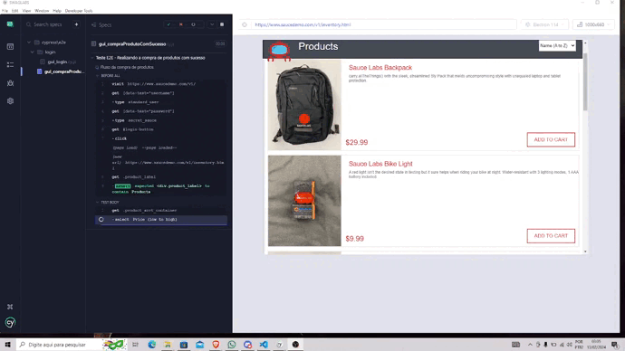

# TESTE AUTOMATIZADO COM CYPRESS

### site: https://www.saucedemo.com/v1/

## SOBRE

### Este repositório tem o propósito de apresentar um teste realizado em um site de commpras da Saudemo com foco em automatizar testes de E2E focando a funcionalidade dos cenários propostos. 

## Ferramentas utilizadas: Cypress/VsCode Studio

  

f)
